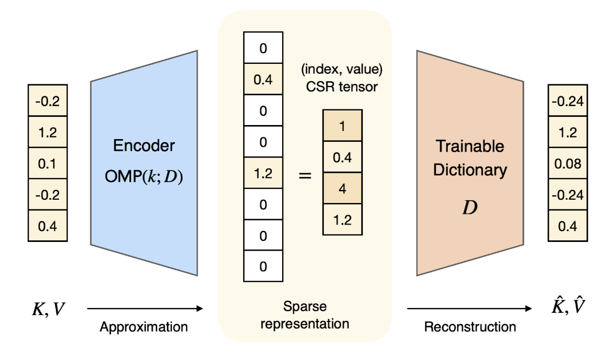
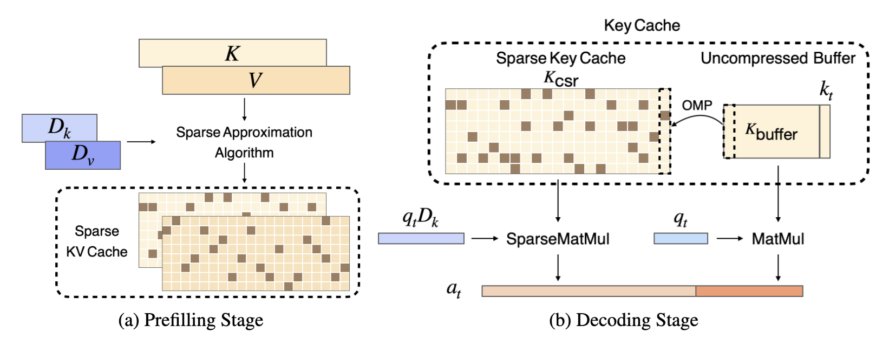

  ---

<div align="center">    

# Lexico: Extreme KV Cache Compression via Sparse Coding over Universal Dictionaries

[](https://arxiv.org/abs/2412.08890)

</div>

## Description  
(Repository WIP)

We introduce **Lexico**, a novel KV cache compression method that leverages sparse coding with a universal dictionary.
Our key finding is that the key-value cache in modern LLMs can be accurately approximated using a sparse linear combination from a **small, input-agnostic dictionary** of approximately 4k atoms, enabling efficient compression across different input prompts, tasks, and models.  

### Lexico’s Three-Step Compression Process  

Lexico utilizes both **sparsity-based compression** (Steps 1 and 2) and **quantization** (Step 3) through the following steps:
1. **Dictionary Pretraining**  
   - Train a dictionary on **WikiText-103** for each model.  
   - The dictionary is trained **only once** and used universally across all tasks.  
   - It occupies **constant memory** and does not increase with batch size.  
  
   

2. **Sparse Decomposition**  
   - During **prefilling** and **decoding**, Lexico **decomposes key-value pairs** into a sparse linear combination.  
   - Each pair is represented by **s reconstruction coefficients** and **dictionary indices**.  

   

3. **Lightweight Sparse Coefficients**  
   - Higher KV cache compression rates are achieved by **storing sparse coefficients in 8-bit precision** instead of FP16.  
   - **Lowering precision to 8 bits yields minimal performance degradation** while significantly improving memory efficiency.  


## Installation
First, install the necessary dependencies:  
```bash
# clone repository   
git clone https://github.com/krafton-ai/lexico

# install project
pip install -e .
```

## Training Universal Dictionaries on WikiText
To train universal dictionaries on WikiText, run the following commands with the desired model, dictionary size, and sparsity:
```bash
# navigate to dictionary learning directory
cd lexico/dictionary_learning

# run dictionary training
python train.py --model_name_or_path "meta-llama/Llama-3.2-3B-Instruct" --dictionary_size 4096 --sparsity 8
```
After training, update the `path_to_dictionary.json` file in the `lexico` directory to map the model and dictionary settings to the corresponding dictionary file path.

For example:

```json
{
    "meta-llama/Llama-3.2-3B-Instruct_N_4096_s_8": "dictionary_learning/dictionaries/meta-llama_Llama-3.2-3B-Instruct_N_4096_s_8.pt"
}
```

## Inference
Refer to `example.py` for an example of how to perform inference using the trained dictionary.

## Citation   
```
@misc{kim2024lexicoextremekvcache,
      title={Lexico: Extreme KV Cache Compression via Sparse Coding over Universal Dictionaries}, 
      author={Junhyuck Kim and Jongho Park and Jaewoong Cho and Dimitris Papailiopoulos},
      year={2024},
      eprint={2412.08890},
      archivePrefix={arXiv},
      primaryClass={cs.LG},
      url={https://arxiv.org/abs/2412.08890}, 
}
```
